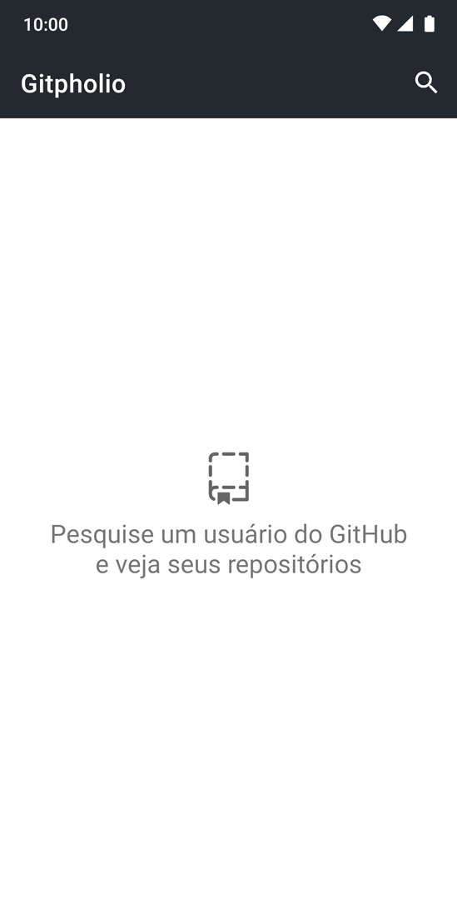
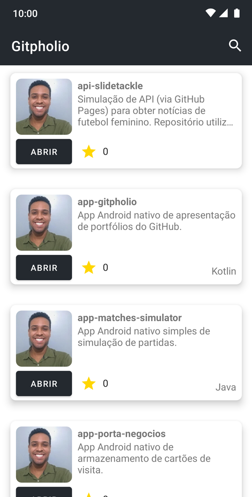

# Gitpholio  
*Aplicativo desenvolvido como desafio de projeto para o bootcamp 'Santander Mobile Developer' da [DIO](https://www.dio.me/).* 

Ao pesquisar por um usuário do GitHub, o aplicativo retorna a sua lista de repositórios, exibindo o título, a descrição, a quantidade de estrelas recebidas 
e a linguagem de cada um destes.  
Também é possível ser redirecionado a um repositório específico ao clicar no botão "abrir".  

Uma vez feita uma busca, a listagem de repositórios do usuário pesquisado assume o espaço da página inicial até que uma nova pesquisa seja feita ou 
o app seja fechado e aberto novamente.

## **Implementações e ferramentas utilizadas** 
- [Coroutines](https://developer.android.com/kotlin/coroutines), 
[Glide](https://bumptech.github.io/glide/), 
[Gson](https://square.github.io/retrofit/), 
[Koin](https://insert-koin.io/docs/quickstart/android/), 
[Lifecycle](https://developer.android.com/topic/libraries/architecture/lifecycle), 
[OkHttp](https://square.github.io/okhttp/), 
[RecyclerView](https://developer.android.com/guide/topics/ui/layout/recyclerview), 
[Retrofit](https://square.github.io/retrofit/)
e [ViewBinding](https://developer.android.com/topic/libraries/view-binding);
- [Biblioteca de ícones utilizada](https://primer.style/octicons/).
  
### Capturas de tela

  
   
   

